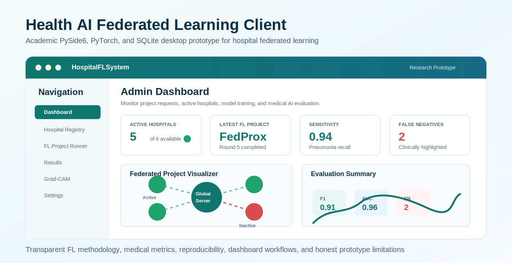

# Health AI Federated Learning Client

<p align="center">
  
</p>

<p align="center">
  <a href="https://github.com/YOUR_USERNAME/health-ai-federated-learning-client/releases/latest/download/HospitalFLSystem_Demo_Setup.zip">
    <strong>Download Windows Demo Installer</strong>
  </a>
</p>

Academic PySide6 + PyTorch + FastAPI prototype for studying federated learning across hospital chest X-ray pneumonia classifiers.

This project is a research and teaching prototype. It is not a clinical device.

> Demo download note: the Windows installer is distributed through GitHub Releases as `HospitalFLSystem_Demo_Setup.zip`. The generated installer ZIP is not committed to the source repository because it is a large binary artifact.

For the main academic master report, see [docs/ACADEMIC_MASTER_REPORT.md](docs/ACADEMIC_MASTER_REPORT.md).
For supporting technical documentation, see [docs/PROJECT_DOCUMENTATION.md](docs/PROJECT_DOCUMENTATION.md).
For publishing the project professionally on GitHub, see [docs/GITHUB_PUBLISHING_GUIDE.md](docs/GITHUB_PUBLISHING_GUIDE.md).

## GitHub Safety Note

The repository is configured to keep source code, documentation, tests, configuration, and build scripts under version control while excluding local datasets, trained model checkpoints, SQLite databases, reports, Docker exports, virtual environments, and generated Windows build outputs.

## Windows Demo Download

The recommended way to share the `.exe` setup with users is through GitHub Releases:

1. Build the installer with PyInstaller and Inno Setup.
2. Run `package_demo_zip.bat`.
3. Upload `release/HospitalFLSystem_Demo_Setup.zip` to a GitHub Release.
4. Replace `YOUR_USERNAME` in the download link above with your GitHub username.
5. Name the uploaded Release asset exactly `HospitalFLSystem_Demo_Setup.zip`.

This keeps the repository source-code focused while still giving visitors a clear demo download.

## Project Objective

The objective is to compare local-only, centralized, FedAvg, and FedProx training for binary chest X-ray classification:

- `NORMAL`
- `PNEUMONIA`

The code emphasizes reproducibility, transparent metrics, non-IID simulation, and honest privacy/security boundaries.

## System Architecture

| Area | Main files | Purpose |
| --- | --- | --- |
| Dataset handling | `core/dataset_manager.py`, `core/non_iid.py` | Validate folders, summarize distributions, create reproducible splits, simulate hospital data skew. |
| Model/training | `core/model_loader.py`, `core/trainer.py` | DenseNet121 binary head, BCEWithLogitsLoss, class imbalance handling, threshold tuning, best checkpoint saving. |
| Federated simulation | `core/fl_engine.py` | Partial participation, weighted FedAvg aggregation, FedProx local objective, per-round tracking. |
| Evaluation | `core/metrics.py`, `core/experiment_runner.py`, `core/report_generator.py` | Accuracy, precision, recall, F1, ROC-AUC, sensitivity, specificity, confusion matrices, CSV/JSON reports. |
| Persistence | `core/db.py` | SQLite schema for experiments, model versions, federated rounds, client updates, metrics, confusion matrices. |
| UI | `ui/pages/*.py` | Dataset validation, training controls, FL monitoring, Grad-CAM, results tables. |
| Mock coordinator | `server/mock_fl_server.py` | Prototype server for model upload/download testing only. |

## Dataset Description

Folder datasets must use:

```text
dataset_root/
  NORMAL/
  PNEUMONIA/
```

The dataset manager records total images, class distribution, train/validation/test counts, imbalance ratio, invalid images, and warnings for missing classes, small datasets, and severe imbalance.

Validation and test transforms do not use augmentation. Training transforms use mild geometric augmentation.

## Federated Learning Methodology

Each round selects a subset of participating hospitals according to `participation_fraction`. Each selected hospital trains locally and sends a model update with its local sample count.

### FedAvg

Weighted aggregation is used:

```text
w_global = sum_k ((n_k / sum_j n_j) * w_k)
```

where `n_k` is the number of local training samples for client `k`.

### FedProx

FedProx uses the same weighted server aggregation but changes the local objective:

```text
Loss = BCEWithLogitsLoss + (mu / 2) * ||w_local - w_global||^2
```

The proximal term is computed against the frozen global parameters broadcast at the start of the round.

## Non-IID Simulation

`core/non_iid.py` supports:

- balanced IID split
- label-skew split
- quantity-skew split
- configurable number of simulated hospitals
- configurable imbalance severity

Non-IID data matters because hospitals can differ in patient demographics, imaging devices, disease prevalence, and labeling protocols. A method that works on IID partitions can fail or converge poorly when each hospital observes a different distribution.

## Training Pipeline

DenseNet121 is configured with a one-logit binary classifier head. Training uses `BCEWithLogitsLoss`; sigmoid is applied only during inference and evaluation.

Implemented options include ImageNet pretrained initialization, class weighting, weighted sampling, FedAvg/FedProx selection, early stopping, validation-threshold tuning, and checkpoint metadata.

Best checkpoints store architecture, classes, threshold, metrics, date, and training configuration.

## Evaluation Metrics

Reports include:

- accuracy
- precision
- recall / sensitivity for pneumonia
- specificity for normal cases
- F1-score
- ROC-AUC
- false negative count
- false positive count
- confusion matrix
- per-round global metrics
- client-level metrics

False negatives are highlighted because missing pneumonia is clinically serious.

## Threshold Tuning

The validation set can choose thresholds using:

- `best_f1`
- `high_sensitivity`
- `balanced`
- `fixed_0_5`

The chosen threshold is saved in model metadata and reused for test evaluation/inference.

## Privacy and Security Limitations

The prototype keeps image files local during simulated FL training, but this does not make the system secure.

Important limitations:

- Model updates can leak information.
- Secure aggregation is not implemented.
- Differential privacy is not implemented by default.
- Optional update clipping/noise exists only as a simple simulation knob, not a formal DP guarantee.
- The mock FastAPI server is for local testing, not production deployment.

## Grad-CAM Limitations

Grad-CAM is implemented for DenseNet121 using `features.norm5`. It is an explanation aid only. It is not clinical proof, does not guarantee lesion localization, and must not be used as a substitute for radiologist review.

## Running The App

```bash
pip install -r requirements.txt
python app.py
```

Optional mock server:

```bash
python -m uvicorn server.mock_fl_server:app --reload
```

## Running A LAN Federated Demo

On the server machine:

```bash
uvicorn server.mock_fl_server:app --host 0.0.0.0 --port 8000
```

Or use the configured `server_host` and `server_port` from `config/app_config.json`:

```bash
python run_server.py
```

On each hospital/client machine on the same LAN:

```bash
python run_client.py --hospital-id hospital_1 --server-url http://SERVER_IP:8000 --dataset ./data/hospital_1
```

For two clients, run a second client with a different `hospital_id` and dataset path:

```bash
python run_client.py --hospital-id hospital_2 --server-url http://SERVER_IP:8000 --dataset ./data/hospital_2 --request-aggregation --min-clients 2
```

The server exposes:

- `POST /fl/register-client`
- `GET /fl/global-model`
- `POST /fl/upload-update`
- `GET /fl/project-status`
- `POST /fl/aggregate-round`

The older UI-compatible endpoints are still available.

## Secure Aggregation Simulation

Set:

```json
"security_mode": "secure_agg_sim"
```

or pass:

```bash
python run_client.py --security-mode secure_agg_sim ...
```

In this mode, each client uploads a masked weighted model contribution. Pairwise random masks are constructed so the aggregate can be recovered during server aggregation.

This is a simulation only. It does not implement real key exchange, collusion resistance, authenticated clients, or production secure aggregation.

## Homomorphic Encryption Demo

Set:

```bash
python run_client.py --security-mode he_demo ...
```

This attempts a tiny Paillier additive encryption demo for a small vector of metrics if the optional `phe` package is installed. The DenseNet model weights are not encrypted with HE. Full homomorphic encryption of neural-network weights is computationally expensive and is not implemented in this project.

## Running Experiments

Register a dataset in the UI first, then run:

```bash
python run_experiments.py --methods local,centralized,fedavg,fedprox --rounds 3 --num-hospitals 3 --split label_skew --severity 0.7 --participation 0.67 --threshold high_sensitivity --seed 42
```

Repeated seeds:

```bash
python run_experiments.py --methods fedavg,fedprox --rounds 1 --num-hospitals 2 --repeats 3
```

Outputs are written under:

```text
reports/experiments/<run_id>/
```

Each run exports JSON, CSV summaries, per-round CSV files, optional convergence plots, environment information, and the exact experiment configuration.

## Reproducibility

The reproducibility module records:

- run ID
- random seed
- deterministic PyTorch settings where possible
- Python/platform information
- package versions
- exported experiment configuration

Use the same dataset, seed, split strategy, training config, and package environment to reproduce a run as closely as possible.

## Current Limitations

- This is a single-machine simulation, not a deployed multi-hospital system.
- The centralized baseline uses locally registered data, not a real central data warehouse.
- No formal privacy guarantee is provided.
- No clinical validation has been performed.
- Results depend strongly on dataset size, label quality, and split protocol.

## Future Work

- Formal differential privacy accounting.
- Real secure aggregation.
- External validation sets.
- Calibration analysis.
- Multi-label chest X-ray tasks.
- Stronger experiment tracking and statistical comparison across repeated seeds.
