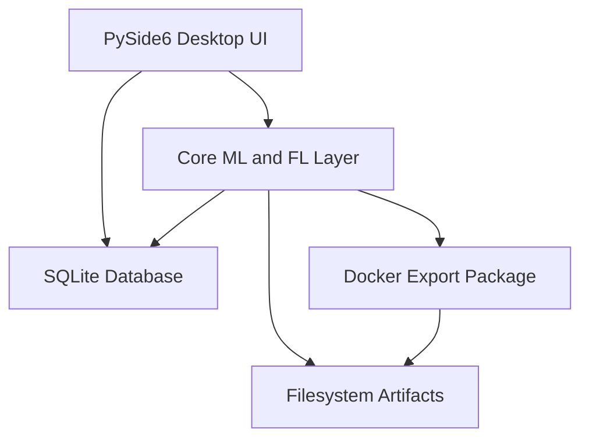

# Health AI Federated Learning Client

## Comprehensive Academic Master Report

Project type: Final Year Project / Academic prototype  
Domain: Medical artificial intelligence, federated learning, chest X-ray classification  
Main technologies: Python, PySide6, PyTorch, Torchvision, SQLite, PyInstaller, Inno Setup  
Primary task: Binary pneumonia classification from chest X-ray images  
Project status: Research and teaching prototype, not a clinical product

---

## Academic Honesty Statement

This project is an academic prototype for studying federated learning workflows in a healthcare setting. It is not a certified medical device, not a hospital production system, and not a clinically validated diagnostic tool. The application demonstrates the technical pipeline around dataset handling, model training, federated simulation, evaluation, visualization, and prototype deployment packaging. It must not be presented as a secure or clinically approved pneumonia diagnosis system.

The project includes privacy-preserving training concepts, but it does not provide a formal privacy guarantee. Raw image files remain local during the federated simulation, but model updates may still leak information. Secure aggregation is implemented only as a simulation. Differential privacy is not formally implemented with privacy accounting. Any deployment package generated by the system is a prototype artifact and is not suitable for clinical use without major validation, security engineering, regulatory review, and medical governance.

---

## Abstract

Medical AI can benefit from data collected across multiple hospitals, but centralizing patient data is difficult because of privacy, legal, institutional, and governance constraints. Federated learning offers a possible alternative by allowing each hospital to train locally and share model updates instead of raw patient data. This project, titled Health AI Federated Learning Client, implements a Windows desktop prototype for federated learning across hospitals using PySide6, PyTorch, and SQLite.

The prototype focuses on binary chest X-ray pneumonia classification with two classes: NORMAL and PNEUMONIA. It supports local training, centralized baseline experimentation, federated FedAvg, federated FedProx, non-IID hospital simulation, threshold tuning, medical evaluation metrics, Grad-CAM visualization, SQLite experiment tracking, secure aggregation simulation, and Docker package export after completed FL projects.

The system is designed for academic demonstration and experimentation rather than clinical deployment. It emphasizes correctness of the federated learning algorithm, transparent evaluation, reproducibility, and honest limitations. The project also includes Windows executable packaging using PyInstaller and installer creation using Inno Setup.

---

## Keywords

Federated learning, medical AI, chest X-ray, pneumonia classification, PyTorch, PySide6, FedAvg, FedProx, non-IID data, DenseNet121, Grad-CAM, sensitivity, specificity, ROC-AUC, SQLite, secure aggregation simulation, Docker deployment package, Windows executable packaging.

---

## Table Of Contents

1. Project overview
2. Problem background
3. Motivation
4. Project objectives
5. Research questions
6. Scope of the system
7. Main contributions
8. System architecture
9. Technology stack
10. Repository structure
11. User roles and workflows
12. Dataset handling
13. Non-IID federated simulation
14. Model architecture
15. Training pipeline
16. Federated learning methodology
17. FedAvg algorithm
18. FedProx algorithm
19. Desktop GUI workflow and project coordination
20. Secure aggregation simulation
21. Homomorphic encryption demo mode
22. Evaluation methodology
23. Medical AI metrics
24. Threshold tuning
25. Grad-CAM explainability
26. Database design
27. UI design and application pages
28. Results and reporting system
29. Docker export after FL completion
30. Windows executable and installer packaging
31. Reproducibility
32. Robustness and error handling
33. Testing strategy
34. Ethical, privacy, and security discussion
35. Limitations
36. Future work
37. How to run the project
38. How to run experiments
39. How to reproduce results
40. Suggested report and PowerPoint structure
41. Conclusion
42. Appendices

---

## 1. Project Overview

Health AI Federated Learning Client is a Python desktop application designed to simulate and demonstrate federated learning for hospital-based medical image classification. The prototype uses a graphical user interface so that both an administrator and hospital users can interact with the workflow.

The main machine learning task is binary pneumonia classification from chest X-ray images. The expected dataset structure is:

```text
dataset_root/
  NORMAL/
  PNEUMONIA/
```

The system supports both demonstration workflows and more technical experiment workflows. The UI is useful for showing how hospitals request participation, how administrators approve projects, how federated rounds proceed, and how results can be reviewed. The experiment runner is useful for comparing training methods systematically.

The project includes:

- Login system with admin and hospital roles
- Admin dashboard
- Hospital dashboard
- Hospital registry management
- Hospital project request workflow
- Admin request approval workflow
- Federated project runner
- Active/inactive hospital status logic
- FL network visualizer
- Dataset manager
- Local training
- FedAvg and FedProx simulation
- Non-IID data splitting
- Results page
- Prediction page
- Grad-CAM page
- SQLite persistence
- Secure aggregation simulation
- Docker package export for completed projects
- Windows executable packaging

---

## 2. Problem Background

Chest X-ray imaging is commonly used in respiratory disease assessment. Pneumonia is a clinically important condition because missed cases can lead to delayed treatment and worsening patient outcomes. Deep learning models can learn useful imaging patterns from large datasets, but medical imaging data is often distributed across institutions.

In real healthcare settings, hospitals may not be allowed or willing to centralize raw patient data because of:

- Patient privacy
- Data governance rules
- Legal restrictions
- Institutional policies
- Data ownership concerns
- Network and storage limitations
- Ethical concerns around secondary data use

Traditional centralized machine learning assumes that all training data can be collected in one place. This assumption is often unrealistic in healthcare. Federated learning addresses this by keeping data local and exchanging model updates instead.

However, federated learning has its own challenges:

- Hospital data is usually non-IID
- Hospitals may have different sample sizes
- Clients may drop out
- Aggregation must account for sample counts
- Evaluation must use medical metrics beyond accuracy
- Model updates may leak information
- Secure aggregation and differential privacy are non-trivial

This project explores these challenges in an academic prototype.

---

## 3. Motivation

The motivation is to build a realistic educational system that demonstrates how federated learning could be used for medical AI while avoiding exaggerated claims. Many prototype systems show attractive interfaces but do not correctly implement core ML/FL details. This project aims to be more academically credible by including:

- Correct sample-weighted aggregation
- FedAvg and FedProx comparison
- Medical metrics such as sensitivity and specificity
- False negative highlighting
- Non-IID simulation
- Threshold tuning
- Reproducibility settings
- Database tracking
- Honest privacy limitations
- Prototype deployment artifacts

The application can be used to support a final year project report, a demonstration, a supervisor review, or a PowerPoint presentation.

---

## 4. Project Objectives

The main objective is to design and implement an academic-grade prototype for federated learning in medical image classification across simulated hospitals.

Specific objectives:

1. Build a desktop application for hospital-side and admin-side FL workflows.
2. Implement local training for binary chest X-ray pneumonia classification.
3. Implement sample-weighted FedAvg.
4. Implement FedProx with a mathematically correct proximal term.
5. Support partial client participation per communication round.
6. Simulate non-IID hospital data distributions.
7. Track client-level and global metrics.
8. Evaluate using medical AI metrics beyond accuracy.
9. Tune classification threshold using validation data.
10. Provide Grad-CAM visualization with clear limitations.
11. Store datasets, models, metrics, FL rounds, and project records in SQLite.
13. Include a secure aggregation simulation without claiming production security.
14. Export Docker prototype packages after FL project completion.
15. Package the application as a Windows executable and installer.

---

## 5. Research Questions

This prototype can support the following research questions:

1. Does federated learning improve performance compared with local-only training?
2. How does FedAvg compare with FedProx under non-IID hospital splits?
3. How does label skew affect global model convergence?
4. How does quantity skew affect client contribution and global performance?
5. How does partial participation affect federated training stability?
6. How does threshold tuning affect false negatives and sensitivity?
7. Can a UI-based prototype communicate FL workflows clearly to non-specialist users?
8. What are the practical limitations of claiming privacy in federated learning?
9. What metadata must be stored to make FL experiments reproducible?
10. What deployment artifacts are useful after a completed FL project?

---

## 6. Scope Of The System

### In Scope

The project includes:

- Desktop app prototype
- Binary image classification
- Chest X-ray folder dataset format
- Local training
- Federated training simulation
- FedAvg and FedProx
- Non-IID simulated hospital splits
- Medical evaluation metrics
- Grad-CAM visualization
- SQLite persistence
- Secure aggregation simulation
- Docker package export
- Windows executable packaging

### Out Of Scope

The project does not include:

- Clinical validation
- Regulatory approval
- Production hospital integration
- Real PACS/RIS/EHR integration
- Real patient identity management
- Full secure aggregation protocol
- Formal differential privacy accounting
- Full homomorphic encryption of neural networks
- Real-time clinical diagnosis
- Large-scale distributed cloud deployment

---

## 7. Main Contributions

The project contributes:

1. An integrated desktop system for demonstrating hospital federated learning workflows.
2. A DenseNet121-based binary pneumonia classifier pipeline.
3. Correct sample-weighted FedAvg aggregation.
4. FedProx local objective with proximal regularization.
5. A non-IID simulation module for balanced IID, label skew, and quantity skew.
6. A medical evaluation module emphasizing sensitivity, specificity, and false negatives.
7. Threshold tuning strategies suitable for medical screening trade-offs.
8. Grad-CAM visualization with clinically honest disclaimers.
9. SQLite tracking of datasets, training, FL rounds, metrics, and exports.
11. A secure aggregation simulation module for educational purposes.
12. Docker export packages for completed FL projects.
13. Windows executable and installer packaging support.

---

## 8. System Architecture

The system can be described as layered architecture.



### UI Layer

Implemented in:

```text
ui/
```

The UI provides pages for:

- Login
- Dashboard
- Dataset management
- Prediction
- Grad-CAM
- Local training
- Project requests
- Project invitations
- Project runner
- Results
- Hospital registry
- Profile

### Core Layer

Implemented in:

```text
core/
```

The core layer contains:

- Dataset management
- Data generation
- Model loading
- Training
- Federated engine
- Non-IID splitting
- Metrics
- Experiment runner
- Report generation
- Grad-CAM
- Secure aggregation simulation
- Docker export
- Reproducibility utilities

### Persistence Layer

Implemented in:

```text
core/db.py
database/hospital_client.db
```

SQLite stores:

- Hospital profiles
- Dataset records
- Images
- Model versions
- Training runs
- Federated rounds
- Client updates
- Experiment runs
- Evaluation metrics
- Confusion matrices
- Project requests
- Project memberships
- Docker exports
- Activity logs

### Filesystem Artifact Layer

The application writes:

- model checkpoints
- reports
- predictions
- visualizations
- Docker packages
- installer build outputs

When running as a packaged executable, writable files are stored under:

```text
%APPDATA%\HospitalFLSystem
```

---

## 9. Technology Stack

| Area | Technology | Purpose |
| --- | --- | --- |
| Programming language | Python | Main implementation language |
| Desktop UI | PySide6 | Windows desktop GUI |
| Deep learning | PyTorch | Model training and inference |
| Vision models | Torchvision | DenseNet121 backbone |
| Data handling | pandas, Pillow | Dataset scanning and image validation |
| ML utilities | scikit-learn | Splitting and metrics support |
| Visualization | OpenCV, PySide painting | Grad-CAM and network visualizer |
| Persistence | SQLite | Local database |
| Packaging | PyInstaller | Windows executable folder |
| Installer | Inno Setup | Windows installer |
| Deployment artifact | Docker files | Prototype model deployment package |

---

## 10. Repository Structure

Important files and folders:

```text
hospital_fl_client/
  app.py
  README.md
  README_BUILD.md
  requirements.txt
  HospitalFLSystem.spec
  build_exe.bat

  assets/
    style.qss

  config/
    app_config.json

  core/
    config_manager.py
    data_generator.py
    dataset_manager.py
    db.py
    docker_exporter.py
    experiment_runner.py
    fl_engine.py
    gradcam_engine.py
    inference.py
    metrics.py
    model_loader.py
    non_iid.py
    report_generator.py
    reproducibility.py
    secure_aggregation.py
    trainer.py

  data/
    predictions/
    visualizations/

  database/
    hospital_client.db

  docs/
    PROJECT_DOCUMENTATION.md
    ACADEMIC_MASTER_REPORT.md

  installer/
    HospitalFLSystem.iss

  models/
    local/

  reports/
    experiments/


  tests/
    test_secure_aggregation.py
    test_docker_exporter.py

  ui/
    login_window.py
    main_window.py
    pages/
    widgets/
```

---

## 11. User Roles And Workflows

The system supports two main roles.

### Admin Role

The admin can:

- View system dashboard
- Manage hospital registry
- Mark hospitals active or inactive
- Review FL project requests
- Approve or reject project requests
- Create FL projects directly
- Run federated project simulation
- Monitor active/inactive hospitals
- View all completed project Docker export options
- View results and reports

### Hospital Role

A hospital can:

- Log in as a hospital node
- View hospital dashboard
- Request a new FL project
- Accept or decline invitations
- Register local dataset
- Run local prediction
- Generate Grad-CAM explanations
- Run local training
- View project results
- Export Docker package for completed projects it joined
- Toggle its active/inactive profile status

### Active And Inactive Hospital Logic

Hospitals can be:

- Active
- Inactive / Unavailable

Inactive hospitals:

- appear red/unavailable in visualizations
- cannot be selected for new FL participation
- cannot accept new FL invitations
- are skipped in training animation rounds
- do not send or receive model update particles
- are not used logically in active FL rounds

If an inactive hospital was already part of an old project, it remains visible as unavailable but does not participate in communication animation.

---

## 12. Dataset Handling

Dataset handling is implemented in:

```text
core/dataset_manager.py
```

### Expected Dataset Format

The expected folder structure is:

```text
dataset_root/
  NORMAL/
    image1.jpeg
    image2.jpeg
  PNEUMONIA/
    image3.jpeg
    image4.jpeg
```

The project treats:

```text
NORMAL = 0
PNEUMONIA = 1
```

### Supported Image Extensions

Typical supported formats include:

- `.png`
- `.jpg`
- `.jpeg`
- `.bmp`
- `.webp`

### Dataset Validation

The dataset manager checks:

- whether the dataset path exists
- whether required class folders exist
- whether image files are readable
- whether class labels are present
- whether the dataset is empty
- whether class imbalance is severe
- whether invalid images are present

### Dataset Summary

For each dataset, the system stores:

- dataset name
- dataset path
- number of samples
- number of classes
- train count
- validation count
- test count
- class distribution
- split distribution
- imbalance ratio
- invalid image count
- warnings
- random seed

### Train, Validation, And Test Split

The split is configurable. A typical split is:

```text
train = 70 percent
validation = 15 percent
test = 15 percent
```

The random seed is stored to support reproducibility.

### Data Augmentation

Training transforms include mild augmentation:

- resizing
- grayscale conversion to 3 channels
- random rotation
- random affine transformation
- random horizontal flip
- tensor conversion
- ImageNet normalization

Validation and test transforms do not use random augmentation. This is important because validation and test results should estimate real model performance, not augmented sample behavior.

---

## 13. Non-IID Federated Simulation

Non-IID simulation is implemented in:

```text
core/non_iid.py
```

Federated learning assumes multiple clients, but hospital data is rarely identically distributed. Hospitals may differ by population, imaging protocol, device quality, disease prevalence, and referral pattern.

### Balanced IID Split

Balanced IID splitting distributes classes evenly across hospitals. It is useful as a controlled baseline.

### Label-Skew Split

Label skew means different hospitals have different class proportions.

Example:

```text
Hospital A: mostly NORMAL
Hospital B: mostly PNEUMONIA
Hospital C: mixed
```

Label skew can cause local model drift because each hospital optimizes on a different label distribution.

### Quantity-Skew Split

Quantity skew means hospitals receive different sample counts.

Example:

```text
Hospital A: 1000 images
Hospital B: 200 images
Hospital C: 50 images
```

This affects aggregation because client sample counts should influence model averaging.

### Configurable Parameters

The non-IID module supports:

- number of simulated hospitals
- split strategy
- imbalance severity
- random seed

### Why Non-IID Matters

In IID data, each hospital has a representative sample of the global distribution. In non-IID data, each hospital sees a biased local distribution. This can:

- slow convergence
- reduce global accuracy
- harm minority clients
- increase local update drift
- make FedAvg unstable
- motivate FedProx

---

## 14. Model Architecture

Model loading is implemented in:

```text
core/model_loader.py
```

The main architecture is:

```text
DenseNet121
```

DenseNet121 is used through Torchvision. The original classifier is replaced with a binary classifier:

```python
model.classifier = nn.Linear(in_features, 1)
```

The model outputs one raw logit.

### Why One Logit?

For binary classification, a one-logit output is standard when using:

```python
BCEWithLogitsLoss
```

The output logit is converted to probability during evaluation/inference:

```python
probability = sigmoid(logit)
```

### Pretrained ImageNet Weights

The model loader supports pretrained ImageNet weights. Transfer learning is useful when the medical dataset is small, but ImageNet pretraining is not medical validation.

### Checkpoint Loading

The model loader handles:

- `state_dict`
- `model_state_dict`
- raw state dictionaries
- `module.` prefixes from DataParallel

It rejects incompatible checkpoints with clear error messages.

---

## 15. Training Pipeline

Training is implemented in:

```text
core/trainer.py
```

### Local Training Steps

1. Load dataset rows.
2. Build transforms.
3. Build class mapping.
4. Create train and validation datasets.
5. Create data loaders.
6. Build DenseNet121 model.
7. Train using BCEWithLogitsLoss.
8. Evaluate on validation data.
9. Tune threshold.
10. Save best checkpoint.
11. Save model metadata and metrics.

### Loss Function

The project uses:

```python
BCEWithLogitsLoss
```

This is better than applying sigmoid before binary cross entropy because it is numerically stable.

### Class Imbalance Handling

The training module supports:

- positive class weighting
- weighted sampler

These are important because pneumonia datasets can be imbalanced.

### Early Stopping

Early stopping prevents overtraining. It can monitor validation metrics and save the best checkpoint rather than the final checkpoint.

### Best Checkpoint

Saved checkpoint metadata includes:

- architecture
- model name
- class names
- threshold
- image size
- metrics
- training configuration
- date/time

---

## 16. Federated Learning Methodology

Federated learning is implemented in:

```text
core/fl_engine.py
```

### FL Round Workflow

Each round follows:

1. Select participating hospitals.
2. Broadcast global model.
3. Each selected hospital trains locally.
4. Each hospital reports local update metadata.
5. Server aggregates completed updates.
6. Global model is evaluated.
7. Round metadata is stored.
8. Improved global model is redistributed.

### Client Update Metadata

Each client update includes:

- hospital ID
- number of local samples
- local loss
- local accuracy
- validation metrics
- update status

### Partial Participation

The system supports partial client participation using:

```text
participation_fraction
```

This simulates real FL systems where not all hospitals participate in every round.

---

## 17. FedAvg Algorithm

FedAvg aggregates client model weights into a new global model.

The correct sample-weighted formula is:

```text
w_global = sum_k ((n_k / N) * w_k)
N = sum_k n_k
```

where:

- `w_k` is the model weight vector from client `k`
- `n_k` is the number of local training samples for client `k`
- `N` is the total number of samples across participating clients

### Why Weighted FedAvg Matters

If one hospital has 1000 images and another has 50 images, averaging them equally gives the small hospital the same influence as the large hospital. This can distort the global model. Weighted FedAvg makes the contribution proportional to sample count.

### Aggregation Safety

The aggregator rejects:

- zero completed clients
- zero total samples
- missing updates
- failed local training results

---

## 18. FedProx Algorithm

FedProx modifies local training by adding a proximal term:

```text
Loss = BCE + (mu / 2) * ||w_local - w_global||^2
```

where:

- `BCE` is binary cross entropy with logits
- `mu` controls proximal strength
- `w_global` is the frozen global model sent at the start of the round
- `w_local` is the current local model

### Why FedProx Is Useful

FedProx is designed for heterogeneous FL settings. When hospitals have non-IID data, local training can drift too far from the global objective. The proximal term discourages this drift.

### FedAvg vs FedProx

| Aspect | FedAvg | FedProx |
| --- | --- | --- |
| Local objective | BCE only | BCE plus proximal penalty |
| Server aggregation | weighted averaging | weighted averaging |
| Useful for IID | yes | yes |
| Useful for non-IID | sometimes unstable | often more stable |
| Extra parameter | none | `mu` |

---

## 19. Desktop GUI Workflow And Project Coordination

The current source version focuses on a desktop GUI simulation workflow. Project coordination is handled through local application state, SQLite records, the project request workflow, the FL project runner, and the results page.

### Admin Coordination Workflow

The admin can:

- register and manage hospitals
- mark hospitals active or inactive
- review project requests
- approve or reject requested FL projects
- select active hospitals for FL runs
- run simulated FL rounds
- inspect final project results
- export Docker packages for completed projects

### Hospital Workflow

Hospital users can:

- request new FL projects
- register local datasets
- run local training and prediction workflows
- generate Grad-CAM outputs
- view joined project results
- export Docker packages when a joined project is completed

### Visual Project Coordination

The dashboard and project runner include a network visualizer showing active hospitals, inactive hospitals, participating nodes, and simulated communication between the central aggregation node and selected hospitals. This visualizer is an explanation aid; metric reporting remains the main evidence for model behavior.

---

## 20. Secure Aggregation Simulation

Implemented in:

```text
core/secure_aggregation.py
```

Enable with:

```json
"security_mode": "secure_agg_sim"
```

### Concept

In secure aggregation, the server should not inspect individual client updates. It should only recover the aggregate.

This prototype simulates that idea by applying masks to client updates. Masks are constructed so that they cancel in the aggregate.

### Simplified Masked Update

Conceptually:

```text
masked_update_k = weighted_update_k + mask_k
sum_k mask_k = 0
```

Then:

```text
sum_k masked_update_k = sum_k weighted_update_k
```

### Important Limitation

This is not real cryptographic secure aggregation.

It does not include:

- real key exchange
- authentication
- collusion resistance
- dropout-resilient cryptographic reconstruction
- production protocol hardening

It should be described as:

```text
secure aggregation simulation
```

not:

```text
secure aggregation implementation
```

---

## 21. Homomorphic Encryption Demo Mode

The project includes an optional HE demo mode:

```text
security_mode = he_demo
```

The HE demo is intentionally small. It is meant to demonstrate additive homomorphic aggregation on a tiny vector or metrics, not full neural network training.

### Why Full HE Is Not Used

Encrypting full DenseNet121 model weights with homomorphic encryption is computationally expensive and not practical for this prototype. Real HE-based training requires specialized optimization and careful cryptographic engineering.

The correct academic statement is:

```text
The project includes a toy additive HE demonstration, but does not implement full homomorphic encryption of neural network weights.
```

---

## 22. Evaluation Methodology

Evaluation is implemented in:

```text
core/metrics.py
core/experiment_runner.py
core/report_generator.py
ui/pages/results_page.py
```

### Compared Methods

The project supports comparison of:

- local-only training
- centralized baseline
- federated FedAvg
- federated FedProx

### Local-Only Baseline

Each hospital trains its own model independently.

This answers:

```text
How well does a hospital perform without collaboration?
```

### Centralized Baseline

All available training data is treated as centrally available.

This answers:

```text
What performance is possible if data centralization were allowed?
```

This is a baseline, not a privacy-preserving method.

### Federated FedAvg

Hospitals train locally and the server aggregates using sample-weighted FedAvg.

### Federated FedProx

Hospitals train locally with the FedProx proximal term and the server aggregates using sample-weighted averaging.

### Per-Round Evaluation

The FL engine records global metrics per communication round when real training/evaluation is performed.

### Client-Level Evaluation

Each local client can record:

- sample count
- local loss
- local accuracy
- validation metrics

---

## 23. Medical AI Metrics

The project intentionally avoids relying only on accuracy.

### Accuracy

```text
accuracy = (TP + TN) / (TP + TN + FP + FN)
```

Accuracy can be misleading in imbalanced datasets.

### Precision

```text
precision = TP / (TP + FP)
```

Precision answers:

```text
When the model predicts pneumonia, how often is it correct?
```

### Recall / Sensitivity

```text
sensitivity = recall = TP / (TP + FN)
```

Sensitivity answers:

```text
How many pneumonia cases did the model detect?
```

This is clinically important.

### Specificity

```text
specificity = TN / (TN + FP)
```

Specificity answers:

```text
How many normal cases did the model correctly identify?
```

### F1-Score

```text
F1 = 2 * precision * recall / (precision + recall)
```

F1 balances precision and recall.

### ROC-AUC

ROC-AUC measures ranking ability across thresholds.

### Confusion Matrix

```text
              Pred NORMAL    Pred PNEUMONIA
True NORMAL       TN              FP
True PNEUMONIA    FN              TP
```

### False Negatives

False negatives are highlighted because they represent pneumonia cases predicted as normal. In a screening context, false negatives can be more clinically serious than false positives.

---

## 24. Threshold Tuning

Medical models should not always use a hardcoded threshold of 0.5.

The project supports:

- `best_f1`
- `high_sensitivity`
- `balanced`
- `fixed_0_5`

### Best F1

Chooses the threshold that maximizes validation F1-score.

### High Sensitivity

Chooses a threshold that prioritizes pneumonia recall. This is useful when missing disease is more serious than over-referral.

### Balanced

Chooses a threshold that balances sensitivity and specificity.

### Fixed 0.5

Uses the conventional 0.5 threshold.

### Metadata

The selected threshold is saved in:

- model checkpoint
- model metadata
- evaluation records

---

## 25. Grad-CAM Explainability

Grad-CAM is implemented in:

```text
core/gradcam_engine.py
ui/pages/gradcam_page.py
```

The target layer for DenseNet121 is:

```text
features.norm5
```

### Outputs

The Grad-CAM module saves:

- original image
- heatmap
- overlay image
- side-by-side comparison

Outputs are written to:

```text
data/visualizations/
```

### Interpretation Warning

Grad-CAM is not clinical proof. It does not guarantee that the model looked at the medically correct region. It should be treated as an explanatory aid only.

Correct academic statement:

```text
Grad-CAM provides a visual explanation aid, but cannot validate clinical correctness by itself.
```

---

## 26. Database Design

Database manager:

```text
core/db.py
```

Database file:

```text
database/hospital_client.db
```

Packaged executable runtime location:

```text
%APPDATA%\HospitalFLSystem\database\hospital_client.db
```

### Main Tables

| Table | Purpose |
| --- | --- |
| `hospital_profile` | hospital registry and active/inactive status |
| `datasets` | dataset metadata and warnings |
| `images` | image paths, labels, and splits |
| `models` | legacy model records |
| `model_versions` | detailed model version metadata |
| `training_runs` | local training history |
| `predictions` | inference results |
| `gradcam_outputs` | Grad-CAM output paths |
| `fl_projects` | FL project configuration and status |
| `project_requests` | hospital project requests |
| `project_memberships` | hospitals invited/joined/declined/unavailable |
| `round_participants` | round-level participant records |
| `federated_rounds` | per-round FL aggregation metrics |
| `client_updates` | client update metrics |
| `experiment_runs` | experiment metadata |
| `evaluation_metrics` | scalar evaluation metrics |
| `confusion_matrices` | confusion matrix records |
| `dataset_distributions` | non-IID distribution summaries |
| `docker_exports` | Docker package export records |
| `activity_logs` | activity and audit-style logs |

### Migration Strategy

Migrations are idempotent. The application checks whether columns exist before adding them. This allows older databases to be upgraded without dropping user data.

---

## 27. UI Design And Application Pages

The user interface uses a modern healthcare-style design:

- clear headings
- light content background
- readable tables
- consistent buttons
- active page highlighting
- clear role-specific pages
- readable dialogs
- no misleading security claims

### Login Page

The login page supports:

- admin login
- hospital login
- hospital selection

This is a prototype login workflow and not a production authentication system.

### Admin Dashboard

Admin dashboard shows:

- administration identity
- hospital registry counts
- latest FL project
- pending requests
- recent activity
- FL network visualizer

### Hospital Dashboard

Hospital dashboard shows:

- hospital node information
- local samples
- latest model
- last prediction
- node status

### Hospital Registry

Admin can:

- add hospitals
- update hospitals
- remove hospitals
- toggle active/inactive status

Inactive hospitals appear as:

```text
Inactive / Unavailable
```

### Request Project Page

Hospitals can request FL projects by selecting:

- project name
- disease target
- dataset schema
- model backbone
- FL algorithm
- training settings
- requested hospitals
- clinical motivation

Inactive hospitals cannot request new participation.

### Admin Requests Page

Admin can:

- review project requests
- approve requests
- reject requests
- open approved project in FL runner

### Project Invitations Page

Hospitals can:

- view invitations
- accept or decline
- export Docker package after completion

Inactive hospitals cannot accept new participation.

### FL Project Runner

Allows:

- project creation
- participant selection
- algorithm selection
- total round setting
- local epoch setting
- non-IID strategy selection
- live training monitor
- Docker export after completion

### Results Page

Shows:

- prediction history
- dataset distributions
- evaluation metrics
- confusion matrices
- model versions
- Docker packages

Note: Demo visual-only runs may not generate full evaluation metric rows unless real training/evaluation is executed. Completed project metadata and Docker export availability are still tracked through `fl_projects` and `docker_exports`.

---

## 28. Results And Reporting System

Reports are generated through:

```text
core/report_generator.py
```

### Result Types

The project can store and report:

- predictions
- evaluation metrics
- confusion matrices
- dataset distributions
- model versions
- FL round metrics
- client-level metrics
- Docker export metadata

### Export Formats

Supported report artifacts include:

- JSON
- CSV
- optional plots

### Experiment Output Location

```text
reports/experiments/<run_id>/
```

### UI Result Tables

The Results page is meant for operational review. The experiment runner outputs are better for formal comparative tables.

---

## 29. Docker Export After FL Completion

Docker export is implemented in:

```text
core/docker_exporter.py
```

### Purpose

After an FL project completes, each joined hospital can export a prototype Docker deployment package for the final trained result.

### Export Validation

The exporter checks:

- project exists
- project status is `completed`
- hospital joined the project
- admin can export for joined hospitals
- hospital can export only its own joined projects

### Output Location

When running from source:

```text
exports/docker/<project_id>/<hospital_name>/
```

When running as `.exe`:

```text
%APPDATA%\HospitalFLSystem\exports\docker\<project_id>\<hospital_name>\
```

### ZIP Output

```text
exports/docker/<project_id>/<hospital_name>_docker_package.zip
```

### Package Contents

Each package contains:

```text
Dockerfile
README_DEPLOY.md
run_container.bat
serve_model.py
project_metadata.json
fl_settings.json
final_metrics.json
hospital_metadata.json
model/
```

### Model Artifact

If a final model file exists, it is copied into:

```text
model/
```

If no real model file exists, the exporter creates:

```text
model/simulated_model_artifact.json
```

This keeps the export workflow functional for demo-only projects while clearly labelling the artifact as simulated.

### Docker Build

Inside the exported package folder:

```powershell
docker build -t hospital-fl-project-<project_id> .
```

### Docker Run

```powershell
docker run --rm hospital-fl-project-<project_id>
```

The included Dockerfile is basic and safe for prototype demonstration. It is not a clinical serving system.

---

## 30. Windows Executable And Installer Packaging

Packaging support includes:

- PyInstaller spec file
- build batch script
- Inno Setup installer script
- runtime path handling
- AppData storage for writable files

### Resource Path Handling

Implemented in:

```text
core/paths.py
```

This supports:

- development paths
- PyInstaller bundled paths
- writable runtime paths

### PyInstaller

PyInstaller creates the executable app folder:

```text
dist/HospitalFLSystem/
```

Build command:

```powershell
build_exe.bat
```

or:

```powershell
pyinstaller --noconfirm --windowed --onedir --name HospitalFLSystem app.py
```

The project uses:

```text
HospitalFLSystem.spec
```

for reliable hidden imports and bundled data files.

### Inno Setup

Inno Setup creates the official Windows installer:

```text
HospitalFLSystem_Setup.exe
```

It adds:

- desktop shortcut
- Start Menu shortcut
- clean install folder
- uninstaller

Installer script:

```text
installer/HospitalFLSystem.iss
```

### Runtime Data Location

When installed as `.exe`, writable data is stored under:

```text
%APPDATA%\HospitalFLSystem
```

This includes:

- config
- database
- models
- reports
- logs
- predictions
- visualizations
- Docker exports

---

## 31. Reproducibility

Reproducibility utilities are implemented in:

```text
core/reproducibility.py
```

The project records:

- random seed
- deterministic PyTorch flag
- package versions
- Python version
- OS/platform
- experiment config
- run ID

### Important Configuration Values

Example:

```json
{
  "random_seed": 42,
  "deterministic_torch": true,
  "default_fl_algorithm": "FedAvg",
  "threshold_strategy": "best_f1",
  "security_mode": "none"
}
```

### Reproducibility Requirements

To reproduce an experiment:

1. Use the same dataset.
2. Use the same split ratios.
3. Use the same random seed.
4. Use the same non-IID strategy.
5. Use the same model/training config.
6. Use the same package versions when possible.
7. Compare exported experiment config files.

---

## 32. Robustness And Error Handling

The system handles:

- empty datasets
- missing folders
- invalid images
- class imbalance warnings
- missing checkpoint files
- corrupted checkpoints
- incompatible model architecture
- server unavailable
- zero-client aggregation
- failed local training
- inactive hospital participation
- incomplete Docker export attempts
- missing final model file

User-facing errors are shown through readable message boxes and activity logs.

---

## 33. Testing Strategy

The project includes unit tests for:

- secure aggregation simulation
- Docker export validation and artifact creation

Example:

```powershell
python -m unittest tests.test_secure_aggregation tests.test_docker_exporter
```

Recommended additional tests:

- dataset validation test
- non-IID split test
- FedAvg weighting test
- FedProx proximal loss test
- threshold tuning test
- database migration test
- PyInstaller smoke test
- UI workflow manual test

### Manual UI Test Checklist

1. Launch app.
2. Log in as admin.
3. Log in as hospital.
4. Create hospital request.
5. Approve request.
6. Accept invitation.
7. Run FL project.
8. Mark hospital inactive.
9. Confirm inactive hospital is red/unavailable.
10. Confirm inactive hospital is skipped from animation.
11. Complete project.
12. Export Docker package.
13. Open Results page.
14. Export report.
15. Run packaged `.exe`.

---

## 34. Ethical, Privacy, And Security Discussion

### Ethical Considerations

Medical AI systems can affect patient care. Even when used for research, such systems must be designed carefully.

Key ethical issues:

- risk of false negatives
- risk of false positives
- dataset bias
- poor generalization
- lack of external validation
- overtrust in visual explanations
- unclear accountability

### Privacy Considerations

Federated learning reduces raw data transfer, but does not automatically guarantee privacy.

Model updates can leak information through:

- gradient inversion
- membership inference
- model memorization
- update inspection

### Security Considerations

The prototype does not provide:

- production authentication
- secure transport configuration
- real secure aggregation
- formal DP
- audit-grade logging
- access control suitable for hospitals

This must be stated clearly in academic writing.

---

## 35. Limitations

Current limitations:

- academic prototype only
- not clinically validated
- not production secure
- no regulatory approval
- no real hospital integration
- no formal privacy guarantee
- secure aggregation is simulated
- HE demo does not encrypt full model weights
- centralized baseline is simulated
- results depend on dataset size and quality
- Grad-CAM is not proof of correct reasoning
- UI login is a demo login, not secure authentication
- Docker export is a prototype wrapper, not a clinical deployment service

---

## 36. Future Work

Recommended future improvements:

1. Add external validation dataset support.
2. Add calibration metrics and reliability diagrams.
3. Add confidence intervals for evaluation metrics.
4. Add repeated-seed statistical testing.
5. Add formal DP-SGD with privacy accountant.
6. Implement real secure aggregation protocol.
7. Add authenticated client identities.
8. Add TLS and secure server configuration.
9. Add role-based access control.
10. Add model cards and dataset cards.
11. Add fairness analysis across hospitals.
12. Add update norm and drift monitoring.
13. Add better convergence plots.
14. Add multi-label chest X-ray classification.
15. Add DICOM support.
16. Add PACS integration prototype.
17. Add Docker inference API endpoint.
18. Add cloud deployment option.
19. Add automated UI tests.
20. Add full thesis-ready experiment tables.

---

## 37. How To Run The Project

### Install Requirements

```powershell
pip install -r requirements.txt
```

### Run Desktop App

```powershell
python app.py
```

or:

```powershell
.\.venv\Scripts\python.exe app.py
```

### Build Executable

```powershell
build_exe.bat
```

### Run Executable

```powershell
dist\HospitalFLSystem\HospitalFLSystem.exe
```

### Build Installer

Open:

```text
installer/HospitalFLSystem.iss
```

in Inno Setup Compiler and click Compile.

---

## 38. How To Run Experiments

Register a dataset first. The experiment engine is implemented in `core/experiment_runner.py`. If the optional CLI wrapper is present, run:

```powershell
python run_experiments.py --methods local,centralized,fedavg,fedprox --rounds 3 --num-hospitals 3 --split label_skew --severity 0.7 --participation 0.67 --threshold high_sensitivity --seed 42
```

Minimal FedAvg/FedProx run, when the optional CLI wrapper is present:

```powershell
python run_experiments.py --methods fedavg,fedprox --rounds 1 --num-hospitals 2
```

Repeated seed run, when the optional CLI wrapper is present:

```powershell
python run_experiments.py --methods fedavg,fedprox --rounds 1 --num-hospitals 2 --repeats 3
```

Outputs:

```text
reports/experiments/<run_id>/
```

---

## 39. How To Reproduce Results

1. Save the dataset.
2. Record dataset path and split ratios.
3. Export experiment configuration.
4. Use the same seed.
5. Use the same non-IID strategy.
6. Use the same algorithm and training parameters.
7. Use the same environment if possible.
8. Compare generated CSV/JSON report files.

---

## 40. Suggested Report And PowerPoint Structure

### Suggested FYP Report Chapters

1. Introduction
2. Background and literature review
3. Problem statement
4. Aim and objectives
5. System requirements
6. System design and architecture
7. Dataset and preprocessing
8. Model architecture
9. Federated learning methodology
10. Evaluation methodology
11. Implementation
12. Results
13. Discussion
14. Security and privacy limitations
15. Deployment and packaging
16. Conclusion
17. Future work

### Suggested PowerPoint Sections

1. Title slide
2. Problem motivation
3. Why federated learning
4. Project objective
5. System architecture
6. Dataset format
7. Model pipeline
8. FedAvg and FedProx
9. Non-IID simulation
10. Evaluation metrics
11. UI demonstration
12. Results tables
13. Docker export
14. Privacy limitations
15. Conclusion and future work

### Suggested Demo Flow

1. Launch app.
2. Log in as hospital.
3. Request FL project.
4. Log in as admin.
5. Approve request.
6. Show active/inactive hospitals.
7. Run project.
8. Open results.
9. Export Docker package.
10. Show generated files.

---

## 41. Conclusion

Health AI Federated Learning Client demonstrates how a hospital-oriented federated learning prototype can be built using Python desktop and ML tools. The project goes beyond a simple UI demo by implementing important academic features: sample-weighted FedAvg, FedProx, non-IID splitting, medical metrics, threshold tuning, Grad-CAM explanations, database tracking, secure aggregation simulation, and deployment packaging.

The system is strongest as an educational and research prototype. It is useful for demonstrating FL concepts, comparing algorithms, and preparing academic reports or presentations. Its main limitation is that it is not clinically validated and not production secure. These limitations are explicitly documented so the project can be presented honestly and professionally.

---

## 42. Appendices

### Appendix A: Key Commands

Run app:

```powershell
python app.py
```

Run experiments, when the optional CLI wrapper is present:

```powershell
python run_experiments.py --methods fedavg,fedprox --rounds 1 --num-hospitals 2
```

Build exe:

```powershell
build_exe.bat
```

Build installer:

```powershell
iscc installer\HospitalFLSystem.iss
```

### Appendix B: Main Configuration Fields

```json
{
  "hospital_id": "HOSP_101",
  "hospital_name": "BAU Hospital",
  "models_dir": "models",
  "dataset_dir": "data/raw",
  "reports_dir": "reports",
  "database_path": "database/hospital_client.db",
  "device": "auto",
  "random_seed": 42,
  "deterministic_torch": true,
  "default_fl_algorithm": "FedAvg",
  "threshold_strategy": "best_f1",
  "security_mode": "none"
}
```

### Appendix C: Docker Export Folder Example

```text
exports/docker/3/American_University_of_Beirut_Medical_Center/
  Dockerfile
  README_DEPLOY.md
  run_container.bat
  serve_model.py
  project_metadata.json
  fl_settings.json
  final_metrics.json
  hospital_metadata.json
  model/
```

ZIP:

```text
exports/docker/3/American_University_of_Beirut_Medical_Center_docker_package.zip
```

### Appendix D: Result Table Template

| Method | Split | Accuracy | Precision | Recall/Sensitivity | Specificity | F1 | ROC-AUC | FN | FP |
| --- | --- | ---: | ---: | ---: | ---: | ---: | ---: | ---: | ---: |
| Local-only | test | TBD | TBD | TBD | TBD | TBD | TBD | TBD | TBD |
| Centralized | test | TBD | TBD | TBD | TBD | TBD | TBD | TBD | TBD |
| FedAvg | test | TBD | TBD | TBD | TBD | TBD | TBD | TBD | TBD |
| FedProx | test | TBD | TBD | TBD | TBD | TBD | TBD | TBD | TBD |

### Appendix E: FL Round Table Template

| Round | Algorithm | Participating Hospitals | Total Samples | Global Accuracy | Global Loss | Sensitivity | Specificity | FN | FP |
| ---: | --- | --- | ---: | ---: | ---: | ---: | ---: | ---: | ---: |
| 1 | FedAvg | TBD | TBD | TBD | TBD | TBD | TBD | TBD | TBD |
| 2 | FedAvg | TBD | TBD | TBD | TBD | TBD | TBD | TBD | TBD |

### Appendix F: Client-Level Table Template

| Round | Hospital | Samples | Local Loss | Local Accuracy | Status |
| ---: | --- | ---: | ---: | ---: | --- |
| 1 | Hospital A | TBD | TBD | TBD | completed |
| 1 | Hospital B | TBD | TBD | TBD | completed |

### Appendix G: Correct Terminology

Use:

- academic prototype
- FL simulation
- federated aggregation prototype
- secure aggregation simulation
- prototype Docker deployment package
- research system

Avoid:

- clinically validated
- production secure
- fully privacy-preserving
- certified medical device
- guaranteed diagnosis
- secure aggregation implementation
